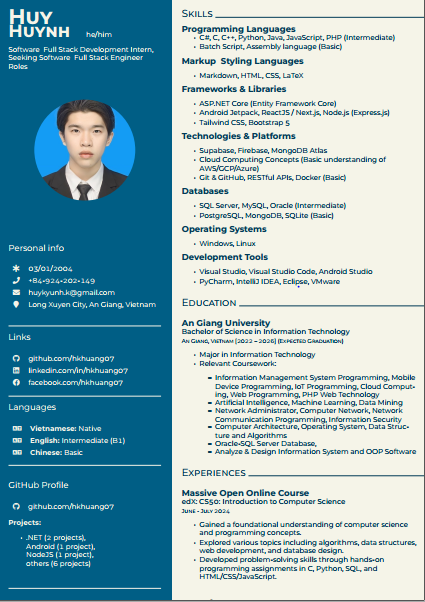
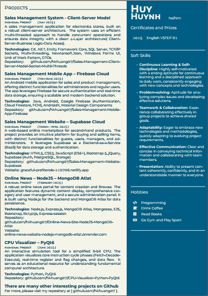

# Hi Guys - I'm Huynh Quoc Huy👋

  
  

    <h2>👨‍💻 Huynh Quoc Huy - Passionate Software & Full Stack Development Intern</h2>
    <h3>Seeking Software & Full Stack Engineer Roles</h3>
     
    I am a passionate and dedicated student pursuing a career in software development. With a strong academic foundation and hands-on experience from various personal projects, I am eager to apply my skills in a professional setting. My journey in technology is driven by a curiosity to learn and a commitment to building robust, scalable, and efficient software solutions.
  

 

  

    
    
  

---

## 📌 **Contact & Personal Information**

* **Date of Birth:** 03/01/2004
* **Phone:** `+84-924-202-149`
* **Email:** `huykyunh.k@gmail.com`
* **Location:** Long Xuyen City, An Giang, Vietnam

---

## 🌐 **Online Presence**

You can find me and my work on the following platforms:

* **GitHub:** [https://github.com/hkhuang07](https://github.com/hkhuang07)
* **LinkedIn:** [https://www.linkedin.com/in/hkhuang07/](https://www.linkedin.com/in/hkhuang07/)
* **Facebook:** [https://www.facebook.com/hk.huang07](https://www.facebook.com/hk.huang07)

---

## 🛠️ **Technical Skills**

A detailed overview of my technical expertise, categorized by domain.

### 💻 **Programming Languages**

* **Intermediate:** C#, C, C++, Python, Java, JavaScript, PHP
* **Basic:** Batch Script, Assembly language

### 🎨 **Markup & Styling Languages**

* Markdown, HTML, CSS, LaTeX

### 📦 **Frameworks & Libraries**

* **Backend:** ASP.NET Core (Entity Framework Core), Node.js (Express.js)
* **Frontend:** ReactJS / Next.js, Tailwind CSS, Bootstrap 5
* **Mobile:** Android Jetpack

### ☁️ **Technologies & Platforms**

* **Cloud Services:** Supabase, Firebase, MongoDB Atlas
* **DevOps & Tools:** Git & GitHub, RESTful APIs, Docker (Basic)
* **Concepts:** Cloud Computing (Basic understanding of AWS/GCP/Azure)

### 🗃️ **Databases**

* **Intermediate:** SQL Server, MySQL, Oracle
* **Basic:** PostgreSQL, MongoDB, SQLite

### 🖥️ **Operating Systems & Tools**

* **OS:** Windows, Linux
* **IDEs & Tools:** Visual Studio, Visual Studio Code, Android Studio, PyCharm, IntelliJ IDEA, Eclipse, VMware

---

## 🎓 **Education**

### **An Giang University**

* **Bachelor of Science in Information Technology**
* *An Giang, Vietnam [2022 – 2026] (Expected Graduation)*
* **Major:** Information Technology
* **Relevant Coursework:**
    * **Software Development:** Information Management System Programming, Mobile Device Programming, Web Programming, PHP Web Technology, Analyze & Design Information System and OOP Software, Data Structure and Algorithms.
    * **Data & AI:** Artificial Intelligence, Machine Learning, Data Mining, Oracle-SQL Server Database.
    * **Systems & Networks:** Computer Architecture, Operating System, Computer Network, Network Communication Programming, Information Security, Network Administrator.
    * **Emerging Technologies:** IoT Programming, Cloud Computing.

---

## 💼 **Experiences**

### **Massive Open Online Course**

* **edX: CS50: Introduction to Computer Science**
* *June - July 2024*
* Successfully completed a rigorous introductory course to computer science, gaining a foundational understanding of core programming concepts and computational thinking.
* Explored fundamental topics including algorithms, data structures, and software engineering principles.
* Developed strong problem-solving skills by completing hands-on programming assignments in multiple languages, including **C**, **Python**, **SQL**, and **HTML/CSS/JavaScript**.

---

## 🏆 **Featured Projects**

Here are some of my key projects that demonstrate my skills in action. For a full list, please visit my GitHub profile.

### **Sales Management System - Client-Server Model**

* **Description:** A robust sales management application designed for electronics stores. This project utilizes a classic **client-server architecture** with an efficient **multi-threaded** approach to handle concurrent operations. The system is built on a clean **4-Layer architecture** (Client, Server, Business Logic, and Data Access) to ensure modularity and data integrity.
* **Technologies:** C#, .NET, Entity Framework Core, SQL Server, TCP/IP Sockets, Multi-threading, Newtonsoft.Json, Windows Forms UI, Unit of Work Pattern, DTOs.
* **Repository:** [https://github.com/hkhuang07/Sales-Management-Client-Server-Model-Socket-Multil-Threads](https://github.com/hkhuang07/Sales-Management-Client-Server-Model-Socket-Multil-Threads)

### **Sales Management Mobile App – Firebase Cloud**

* **Description:** An intuitive **Android mobile application** for managing sales and products. It provides distinct user experiences for administrators and regular users. The backend is powered by **Google Firebase**, leveraging its robust services for secure user **authentication** and **real-time data storage** (Cloud Firestore), making it a scalable and modern solution.
* **Technologies:** Java, Android, Google Firebase (Authentication, Cloud Firestore), AndroidX, Material Design Components.
* **Repository:** [https://github.com/hkhuang07/Sales-Management-Mobile-App-Firebase](https://github.com/hkhuang07/Sales-Management-Mobile-App-Firebase)

### **Sales Management Website – Supabase Cloud**

* **Description:** A web-based online marketplace for buying and selling second-hand products. This project offers a seamless platform with tailored functionalities for different user roles: guests, authenticated users, managers, and administrators. It leverages **Supabase** as a **Backend-as-a-Service (BaaS)**, utilizing its PostgreSQL database and integrated authentication features for a powerful and streamlined backend.
* **Technologies:** HTML5, CSS3, JavaScript (ES6+), Bootstrap 5, jQuery, Supabase (Auth, PostgreSQL, Storage).
* **Repository:** [https://github.com/hkhuang07/Sales-Management-Website-Supabase](https://github.com/hkhuang07/Sales-Management-Website-Supabase)
* **Live Demo:** [https://graceful-profiterole-21b706.netlify.app/](https://graceful-profiterole-21b706.netlify.app/)

### **Online News – NodeJS – MongoDB Atlas**

* **Description:** A robust **online news portal** designed for content creation, management, and Browse. The application features dynamic content display, comprehensive category and user management systems, and a secure administration panel. The backend is built with **Node.js** and **Express.js**, while **MongoDB Atlas** provides a flexible and scalable NoSQL database solution for data persistence.
* **Technologies:** Node.js, Express.js, MongoDB Atlas, Mongoose, EJS, Bootstrap, Bcryptjs, Express-session.
* **Repository:** [https://github.com/hkhuang07/Online-News-Site-NodeJS-MongoDB-Atlat](https://github.com/hkhuang07/Online-News-Site-NodeJS-MongoDB-Atlat)
* **Live Demo:** [https://online-news-website-nodejs-mongodb-atlat.onrender.com/](https://online-news-website-nodejs-mongodb-atlat.onrender.com/)

### **CPU Visualizer – PyQt6**

* **Description:** An interactive educational tool for simulating and visualizing the operations of a simplified **8-bit Central Processing Unit (CPU)**. The application provides a dynamic way to understand fundamental computer architecture by illustrating core instruction cycle phases (**Fetch-Decode-Execute**), real-time changes to registers and flags, and the flow of data within the CPU.
* **Technologies:** Python, PyQt6.
* **Repository:** [https://github.com/hkhuang07/CPU-Visualizer-Python-PyQt6](https://github.com/hkhuang07/CPU-Visualizer-Python-PyQt6)

---

## 📜 **Certificates & Awards**

* **2025:** English VSTEP B1

---

## 🌱 **Hobbies & Interests**

* **Programming:** I am passionate about coding and constantly exploring new technologies.
* **Coffee:** Enjoying a good cup of coffee while coding or reading is a ritual.
* **Reading:** I love reading books, both technical and non-technical, to broaden my knowledge.
* **Fitness:** Going to the gym and playing sports helps me stay active and maintain a healthy work-life balance.

---

## 🤝 Soft Skills 💡

* **Continuous Learning & Self-Discipline:** 📚 Highly self-motivated with a strong aptitude for continuous learning and a disciplined approach to daily work, consistently engaging with new concepts and technologies.
* **Problem-solving:** 🔍 Aptitude for analyzing complex issues and developing effective solutions.
* **Teamwork & Collaboration:** 🤝 Experience collaborating effectively in group projects to achieve shared goals.
* **Adaptability:** 🌀 Eager to embrace new technologies and methodologies, quickly adapting to evolving project requirements.
* **Effective Communication:** 💬 Clear and concise in conveying technical information and collaborating with team members.
* **Presentation:** 💬 Ability to present content coherently, confidently, and in an understandable manner to everyone.
---
